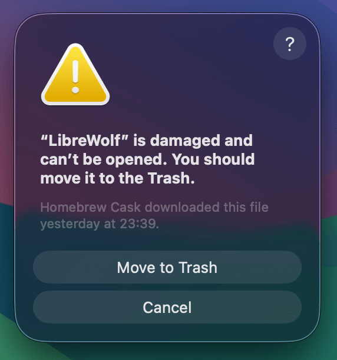

Last night I updated a less-often used machine of mine from macOS 15 Sequoia to Tahoe 26.1. When launching Librewolf, I was greeted by this all-too-familiar error about the app being "damaged"...


<!-- image link is relative to the /content directory -->


In the past, this was an easy fix by simply reinstalling with `brew install librewolf --no-quarantine`. However, the `--no-quarantine` option has been deprecated in [Homebrew](https://brew.sh/) due to [Apple dropping support for Intel macs](https://github.com/orgs/Homebrew/discussions/6334). 

For now, the quarantine can be bypassed as follows:

```shell
xattr -d com.apple.quarantine /Applications/Librewolf.app
```

I also found this GitHub Gist that does pretty much the [exact same thing](https://gist.github.com/stilldg/72d2d1c7477ec20a8860af69302feba6). 
