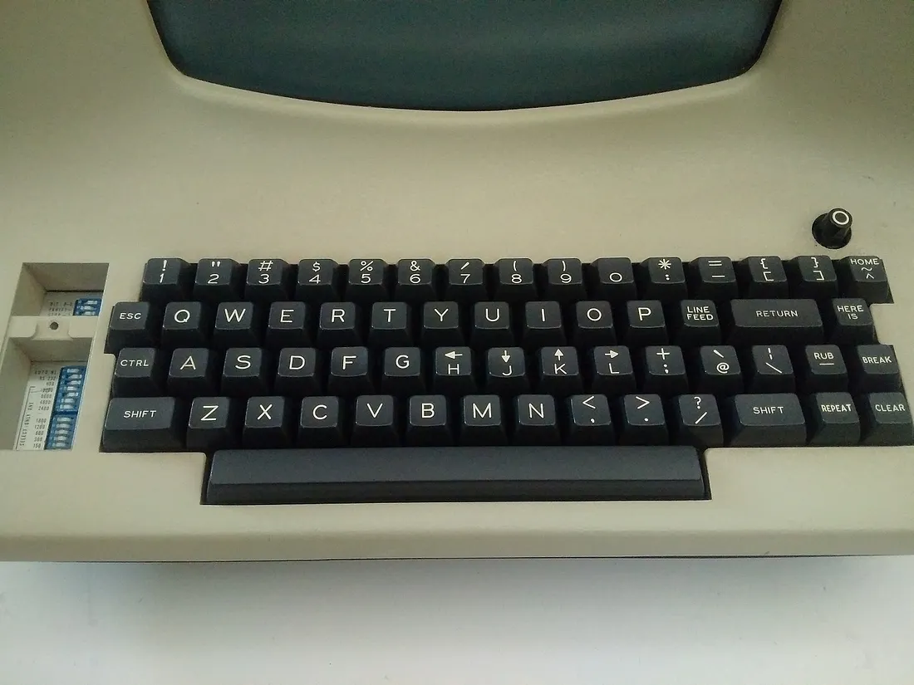

The first thing I do after any fresh install is to install [keyd](https://github.com/rvaiya/keyd). It's fast, works at the OS-level, and has an example/preset that maps <kbd>CapsLock</kbd> to both <kbd>Ctrl</kbd> and <kbd>Esc</kbd> (Where God intended them to be[^1] [^2] [^3] [^4] [^5] [^6] [^7]) AND includes a vim arrow key layer. I think it's just about [perfect](https://github.com/rvaiya/keyd/blob/master/examples/capslock-escape-with-vim-mode.conf)! This utility is the primary reason I spend all my time on my Thinkpad and rarely ever pick up the Macbook anymore (Unless you count installing Asahi). Also, keyd is available from the package manager in both Gentoo and Fedora thanks to [GURU](https://gitweb.gentoo.org/repo/proj/guru.git/tree/app-misc/keyd) and [COPR](https://copr.fedorainfracloud.org/coprs/alternateved/keyd/), respectively.


<sup>Image Source: [https://vintagecomputer.ca/lear-siegler-adm-3a-terminal/](https://vintagecomputer.ca/lear-siegler-adm-3a-terminal/)</sup>

On Gentoo, you will need to install `eselect-repository` first, and then enable the GURU repository:

```
root # emerge -a eselect-repository
root # eselect repository enable guru
root # emerge --sync guru
```

Then you should be able to find keyd with `emerge -s keyd`, although the package is likely masked. Once you unmask the package, you can then emerge it.

```bash
$ echo "app-misc/keyd ~amd64" | sudo tee /etc/portage/package.accept/keyd
$ sudo emerge -a app-misc/keyd
```

Keyd's documentation assumes a system running Systemd. On OpenRC, enable the keyd service with:

```
root # rc-service keyd start
```

If you need to restart keyd (for example, after editing the config file, located at `/etc/keyd/default.conf`), simply restart the daemon.

```
root # rc-service keyd restart
```

The [Gentoo wiki](https://wiki.gentoo.org/wiki/Keyd) has a page on this (of course).

---

# Remap Capslock to <kbd>Ctrl</kbd>/<kbd>Esc</kbd>

If you're on macOS or Windows and are interested in putting the <kbd>control</kbd>/<kbd>escape</kbd> key(s) where God intended them, you're in luck! Although it will take a little more work than what is shown here if you want Vim arrow keys as well.

## macOS

[This article](https://medium.com/@pechyonkin/how-to-map-capslock-to-control-and-escape-on-mac-60523a64022b) is what I used to guide me. You'll need to install Karabiner-Elements and create a complex modification. I ended up also needing to create a "default" profile because this configuration would mess with the keymap on my [Ferris Sweep](https://github.com/davidphilipbarr/sweep) when I am at my desk/dock.

## Windows

The original blog post I followed is [here](https://charlbotha.com/til/Windows-caps-lock---Tap-for-Esc-and-hold-for-Ctrl) and it even worked on my work laptop! This works in two steps: One to swap <kbd>CapsLock</kbd> and <kbd>Ctrl</kbd>, and another to map <kbd>Ctrl</kbd> to <kbd>Esc</kbd> when tapped rather than held.

Basically, run the following in Powershell as administrator:

```powershell
$hexified = "00,00,00,00,00,00,00,00,02,00,00,00,1d,00,3a,00,00,00,00,00".Split(',') | % { };
$kbLayout = 'HKLM:\System\CurrentControlSet\Control\Keyboard Layout';
New-ItemProperty -Path $kbLayout -Name "Scancode Map" -PropertyType Binary -Value ([byte[]]$hexified);
```

Then install AHK and run this script:

```
;; based on https://github.com/fenwar/ahk-caps-ctrl-esc/blob/master/AutoHotkey.ahk
;; modified because I already map capslock to ctrl using windows registry
;; here I'm ONLY adding behaviour that LControl tap results in esc
*LControl::
    Send {Blind}{LControl down}
    return

*LControl up::
    Send {Blind}{LControl Up}
    ;; send Esc only when it was LControl by itself
    if A_PRIORKEY = LControl
    {
        Send {Esc}
    }
    Return
```

There you have it! Happy typing to you all :-)

[^1]: <https://archive.nytimes.com/www.nytimes.com/library/tech/99/08/circuits/articles/19lett.html>

[^2]: <https://sites.pitt.edu/~kconover/keithbet.htm>

[^3]: <https://lowendmac.com/2009/ibm-model-f-a-great-old-keyboard-with-an-outdated-layout/>

[^4]: <https://bobsguides.com/make-capslock-control.html>

[^5]: <https://redlib.catsarch.com/r/MechanicalKeyboards/comments/1u70ok/where_god_intended/>

[^6]: <https://texteditors.org/cgi-bin/wiki.pl?WordStarDiamond>

[^7]: <https://www.cnn.com/TECH/computing/9909/13/happy.hack.idg/index.html>
